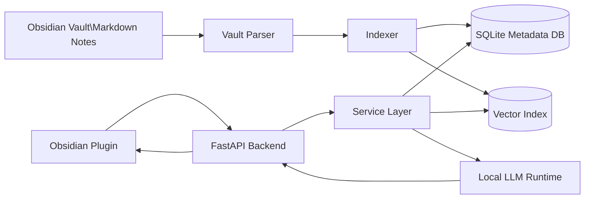

# VaultForge

Local-first AI assistant for Obsidian.

## Planned Features

- sentence completion
- template generation
- vault search with RAG
- formula extraction from PDFs and images

## Architecture

- Obsidian plugin (TypeScript)
- local backend (Python + FastAPI)
- SQLite metadata/index database
- vector search for retrieval
- local LLM runtime

## Status

Work in progress.

## Roadmap

- [x] bootstrap repository
- [x] backend skeleton
- [x] database foundation
- [ ] sample vault + parser
- [ ] indexer
- [ ] obsidian plugin skeleton
- [ ] template generation
- [ ] retrieval
- [ ] formula extraction

## System Architecture

