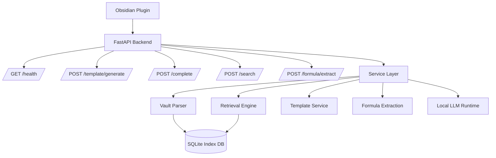

# VaultForge Backend

Local FastAPI backend for VaultForge.

## Responsibilities

- expose local API endpoints
- manage vault indexing
- handle retrieval and search
- process templates
- support OCR and formula extraction later

## API Architecture

